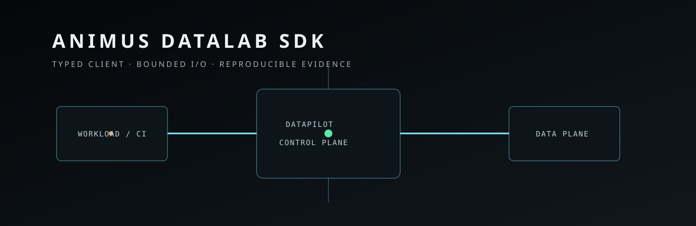

<p align="center">
  
</p>

# Animus DataLab Python SDK

**Typed, zero-runtime-dependency Python integration SDK for Animus DataPilot / Animus DataLab.**

> **Product boundary:** Animus Link is a separate secure-connectivity system. DataLab is the governed ML/research infrastructure platform in the same Animus portfolio. This repository is the client-side DataLab integration layer; it is not part of the Link runtime and does not execute untrusted workloads itself.

## Why this SDK exists

DataLab separates authoritative platform state from workload execution. The **Control Plane** owns metadata, policy, lineage, audit and artifact mediation; the **Data Plane** runs isolated workloads. CI, training containers and operator tooling still need a small, predictable way to consume governed inputs and report evidence without embedding DataLab server code.

This SDK provides that boundary.

Typical uses:

- register/resolve datasets and immutable dataset versions;
- create experiments and immutable run records;
- dispatch a run through project-scoped execution APIs;
- stream metrics, progress and status evidence;
- stream artifact uploads and optionally bound artifact downloads;
- submit signed CI provenance;
- preserve request IDs and normalized failure semantics.

## Contract ownership

**DataLab owns the API contracts; the SDK is a projection of those contracts.**

The 1.2 release line targets the current contract families documented by DataLab, including Dataset Registry `0.2.x` and Experiments `0.3.x`. DataLab owns the canonical OpenAPI definitions under its contract source.

SDK changes affecting paths, payloads or compatibility must be validated against those definitions before release.

`ExperimentsClient.execute_run()` remains for compatibility where supported, while new integrations should prefer project-scoped dispatch through `dispatch_run()`.

## Design goals

- **Zero runtime dependencies by default** — suitable for CI, training images, on-prem and air-gapped environments.
- **Bounded, integrity-aware I/O** — streaming upload/download, atomic replacement and optional SHA-256 verification.
- **Predictable failures** — normalized `AnimusAPIError`, stable request IDs and explicit validation.
- **Typed distribution** — PEP 561 `py.typed` marker and supported Python-version matrix defined by the package/release metadata.
- **Non-blocking telemetry** — bounded background queue, retry/jitter, stable request IDs and observable delivery counters.
- **Supply-chain-ready release path** — build verification and release provenance/attestation controls.

## Install

```bash
pip install animus-datalab
```

Development:

```bash
python -m pip install -e "python[dev]"
```

## Unified client

```python
from animus_sdk import AnimusClient

client = AnimusClient(
    gateway_url="https://datapilot.example.com",
    auth_token="...",
)

project = client.datasets.create_project(
    name="fraud-ml",
    idempotency_key="project-fraud-ml-v1",
)

dataset = client.datasets.create_dataset(
    name="fraud-training",
    metadata={"owner": "ml"},
)

experiment = client.experiments.create_experiment(
    name="baseline",
    metadata={"team": "ml", "project": "fraud"},
)
```

Focused `ExperimentsClient` and `DatasetRegistryClient` clients remain available when the unified client is unnecessary.

## Environment

Common integration variables include:

```text
ANIMUS_GATEWAY_URL
ANIMUS_AUTH_TOKEN
ANIMUS_CI_WEBHOOK_SECRET
DATAPILOT_URL
RUN_ID
TOKEN
```

`DATAPILOT_URL`, `RUN_ID` and `TOKEN` are compatibility inputs for `RunTelemetryLogger.from_env()`; `TOKEN` is a bearer token. `ANIMUS_CI_WEBHOOK_SECRET` is used to sign CI reports/webhooks. Do not bake production bearer tokens, webhook secrets or execution tokens into images, examples, notebooks or repository files. Runtime injection remains the responsibility of the deployment/workload boundary.

## Dataset lifecycle

```python
from animus_sdk import DatasetRegistryClient

client = DatasetRegistryClient(gateway_url="https://datapilot.example.com")

client.create_dataset(
    name="fraud-training",
    metadata={"owner": "ml"},
    idempotency_key="dataset-fraud-training-v1",
)

version = client.upload_dataset_version(
    dataset_id="dataset-id",
    file_path="/data/train.zip",
    metadata={"source": "warehouse", "snapshot": "2026-08-28"},
    quality_rule_id="quality-rule-id",
    idempotency_key="dataset-version-2026-08-28",
)
```

Uploads stream from disk. Downloads can be size-bounded and SHA-256 verified before the destination is atomically replaced.

## Experiments and execution

```python
from animus_sdk import ExperimentsClient

client = ExperimentsClient(gateway_url="https://datapilot.example.com")

run = client.create_run(
    experiment_id="experiment-id",
    dataset_version_id="dataset-version-id",
    status="pending",
    params={"lr": 1e-3},
)

client.dispatch_run(
    project_id="project-id",
    run_id=str(run["run_id"]),
    idempotency_key="dispatch-build-123",
)
```

The SDK requests execution through DataLab; it is not itself the Data Plane and does not gain Kubernetes/host authority merely because it can request a run.

## Signed CI provenance

```python
client.post_ci_report(
    payload={
        "image_digest": "sha256:...",
        "repo": "ghcr.io/acme/train",
        "commit_sha": "deadbeef...",
        "pipeline_id": "build-123",
        "provider": "github_actions",
    }
)
```

CI payloads are canonicalized and reject non-standard JSON values such as NaN/Infinity before signing.

## Artifact I/O

Uploads are streamed rather than buffered as one in-memory object:

```python
client.upload_run_artifact(
    run_id="run-id",
    kind="model",
    file_path="/tmp/model.bin",
    metadata={"format": "safetensors"},
)
```

Integrity-checked download:

```python
meta = client.download_run_artifact(
    run_id="run-id",
    artifact_id="artifact-id",
    dest_path="/models/model.bin",
    max_bytes=8 * 1024 * 1024 * 1024,
    expected_sha256="0123456789abcdef" * 4,
)
```

The SDK writes to a temporary file and atomically replaces the destination only after the configured integrity checks pass.

## Live telemetry

```python
from animus_sdk import RunTelemetryLogger

with RunTelemetryLogger.from_env(timeout_seconds=2.0) as telemetry:
    telemetry.log_status(status="starting")

    for step in range(100):
        telemetry.log_metric(step=step, name="loss", value=1.0 / (step + 1))
        telemetry.log_progress(
            step=step,
            total_steps=100,
            percent=(step + 1) / 100.0,
        )

    telemetry.log_status(status="finished")
    print(telemetry.stats)
```

Telemetry is deliberately best-effort: an observability outage should not crash the training workload. Delivery counters make drops/retries/failures visible.

## Error handling

```python
from animus_sdk import AnimusAPIError

try:
    client.experiments.get_run(run_id="run-id")
except AnimusAPIError as exc:
    print(exc.status, exc.code, exc.request_id)
    if exc.retryable:
        ...
```

Application code should distinguish retryable transport/service failure from policy/validation failure rather than blindly retrying every error.

## Repository map

- `python/` — Python package and tests.
- `docs/` — integration, contract and operational documentation.
- `assets/` — repository-owned visual assets.
- `CHANGELOG.md` — release history.
- `RELEASING.md` — release process.
- `SECURITY.md` — reporting and security boundary.
- `LICENSE` — license terms.

## Development and verification

Use the package metadata and current workflows for the exact supported toolchain. A typical development gate includes package installation, lint/type checks, tests and build verification. Release candidates must also preserve compatibility with the DataLab OpenAPI contract they claim to target.

A useful local flow is:

```bash
python -m pip install -e "python[dev]"
pytest
```

Do not treat a locally successful mock as evidence that a production DataLab endpoint, runner or artifact store is configured.

## Security boundary

The SDK should remain a **small projection**, not a shadow control plane:

- it does not decide RBAC/policy;
- it does not execute arbitrary workloads on its own;
- it does not turn bearer tokens into long-lived stored identity;
- it does not make model output authoritative;
- it does not weaken server-side validation because a typed client produced the request;
- it should fail closed on integrity/validation conditions that protect local artifacts.

## Related

- [`docs/ARCHITECTURE.md`](docs/ARCHITECTURE.md) — SDK and DataLab system boundary.
- [`docs/COMPATIBILITY.md`](docs/COMPATIBILITY.md) — contract and SDK compatibility policy.
- [`SECURITY.md`](SECURITY.md) — security reporting and boundary.

---

<sub>ANIMUS DATALAB SDK · small client surface · authoritative server contracts · reproducible evidence</sub>
